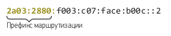
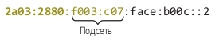
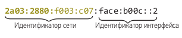
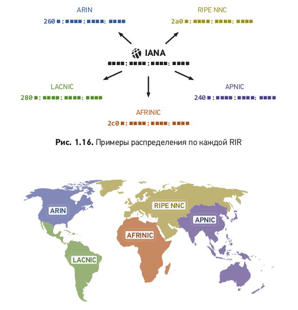

# IP
IP-пакет — форматированный блок информации, передаваемый по компьютерной сети, структура которого определена протоколом IP. 

Основные поля заголовка IP-пакета:

- Версия. Указывает версию IP-протокола (IPv4 или IPv6). 
- Длина заголовка. Определяет длину заголовка в 32-битных словах. 
- Тип сервиса (ToS). Указывает приоритет и качество обслуживания. 
- Общая длина. Общая длина пакета, включая заголовок и данные. 
- Идентификатор. Уникальный идентификатор пакета. 
- Флаги. Управляют фрагментацией пакета. 
- Смещение фрагмента. Указывает положение фрагмента в оригинальном пакете. 
- Время жизни (TTL). Максимальное количество хопов, через которые пакет может пройти. 
- Протокол. Указывает протокол верхнего уровня (например, TCP, UDP). 
- Контрольная сумма заголовка. Проверяет целостность заголовка. 
- IP-адрес источника. Адрес отправителя пакета. 
- IP-адрес назначения. Адрес получателя пакета. 
- Опции. Дополнительные параметры (необязательное поле). 
- Каждый IP-пакет содержит также полезную нагрузку (данные).
## IP-АДРЕСАЦИЯ
Интернет-протокол устанавливает правила работы с адресами место-
положения — поэтому они и называются IP-адресами.Компьютеры
способны отправлять или получать IP-пакеты только после получения
IP-адреса. Разрешение на использование группы IP-адресов в первую
очередь предоставляется организации. Эти адреса затем назначаются
компьютерам, которые прямо или косвенно связаны с этой самой ор-
ганизацией.IP-адрес — это число длиной 128 бит2. Обычно они запи-
сываются в шестнадцатеричном формате с двоеточиями, разделяющими
восемь групп по четыре цифры.
Cамая общая часть почтового адреса — это страна,
самая общая часть IP-адреса — это префикс маршрутизации:

Для целей маршрутизации локальные и глобальные сети с одним и тем
же префиксом организованы в небольшие сети, называемые подсетями.
Между префиксом маршрутизации и серединой IP-адреса указано, в ка-
кой именно подсети находится компьютер.

Наконец, следующие 16 цифр IP-адреса называются идентификатором
интерфейса, поскольку они указывают на конкретный сетевой интерфейс
в подсети. Многие сетевые администраторы попросту заполняют эту часть
IP-адреса MAC-адресом устройства. Эти цифры могут быть любыми, если
они используются только один раз для каждой подсети.

## IANA
Инженеры всего мира согласились с тем, что американская некоммерческая
организация Internet Assigned Numbers Authority (IANA) решает, кто и над
каким префиксом IP-маршрутизации получает контроль. На практике
IANA делегирует большую часть своих полномочий пяти некоммерческим
организациям, которые называются Regional Internet Registries или RIR.
Для этого он выделяет каждой RIR короткие шестнадцатеричные комбина-
ции, которые они могут использовать в качестве первых цифр назначаемых
ими префиксов маршрутизации.Чтобы получить префикс маршрутизации для вашей организации, придет-
ся сделать запрос в RIR того региона, где будут находиться ваши маршру-
тизаторы. Затем этот RIR назначит вам префикс, начинающийся с одной из
своих комбинаций шестнадцатеричных цифр, которые им присвоила IANA.

## ПРОВАЙДЕРЫ ИНТЕРНЕТ-УСЛУГ
Большинство частных лиц и небольших организаций не имеют непосред-
ственного отношения к RIR и не поддерживают пиринговые связи с дру-
гими компьютерными сетями. Вместо этого они покупают подключение
к интернету у специализированных компаний, которые называются
интернет-провайдерами (ISP, Internet Service Providers). Провайдеры
устанавливают маршрутизаторы неподалеку от своих клиентов. Таким
образом, они могут легко подключить один из своих маршрутизаторов
к маршрутизатору в помещении любого клиента. Они же назначают
и префикс маршрутизации для каждого из своих клиентов.
Посмотрим, как это работает на практике. В Великобритании интернет-
провайдер Sky получил префикс маршрутизации `2a02:0c7f`. Sky рабо-
тает во многих британских городах, поэтому префикс делится между их
региональными базами. Например, они назначают `2a02:c7f:48` своей
сети в Милтон-Кинсе и `2a02:c7f:7e` той, что в Ромфорде.