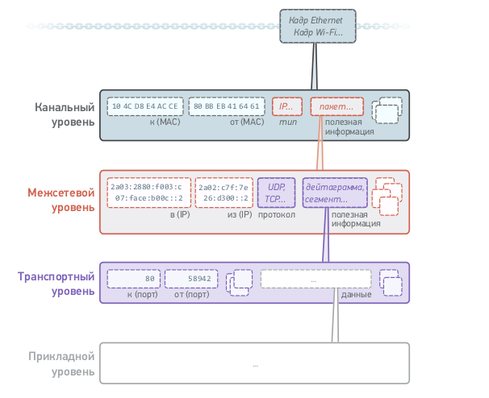

# Levels
## КАНАЛЬНЫЙ УРОВЕНЬ

Канальный уровень-антенны, кабели и другое оборудование для
управления электромагнитными волнами позволяют парам компьютеров
передавать сигналы друг другу.Протоколы канального уровня позволяют
парам компьютеров использовать эти сигналы для обмена данными в ка-
драх. Помимо прочего, каждый кадр содержит MAC-адреса отправителя
и получателя, полезную нагрузку и поле, указывающее правила обработки
полезной нагрузки на уровне интернета.
### MTU
Максимальное количество байтов полезной информации, которое может
быть перенесено в одном кадре, называется его максимальным передава-
емым модулем данных (Maximum Transmission Unit‚ MTU). Различные
протоколы канального уровня имеют разные значения MTU. Для кадров
Ethernet MTU он составляет 1500. Для кадров Wi-Fi это уже 2305.
## МЕЖСЕТЕВОЙ УРОВЕНЬ
Межесетевой уровень-Специальные компьютеры, называемые
маршрутизаторами, способны объединять разные сети в более крупные,
такие как интернет. Благодаря интернет-протоколу полезные данные, упа-
кованные в виде IP-пакетов, могут переходить от одного кадра к другому
и, таким образом, перемещаться между компьютерами, которые не имеют
прямого физического соединения. Каждый пакет содержит IP-адреса
своего отправителя и конечного получателя, полезную нагрузку и поле,
указывающее правила обработки этой полезной нагрузки на транспорт-
ном уровне.
## ТРАНСПОРТНЫЙ УРОВЕНЬ
На удаленных компьютерах размещены
приложения, которым нужно обмениваться данными. Благодаря таким
протоколам, как UDP и TCP, полезные данные, выраженные в виде
дейтаграмм или сегментов, могут формировать потоки данных между
удаленными приложениями. Помимо прочего, каждая дейтаграмма или
сегмент данных содержит фрагмент данных приложения вместе с портами
источника и назначения, через которые эти данные проходят.
И TCP, и UDP используются по-разному в зависимости от характера
связи между приложениями.

### Image levels

